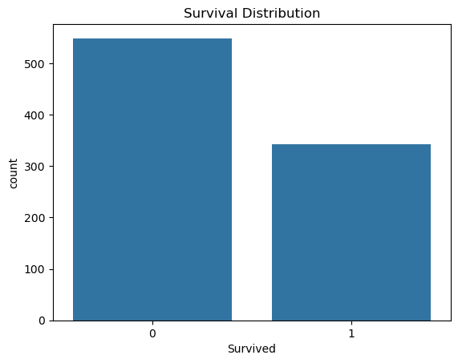
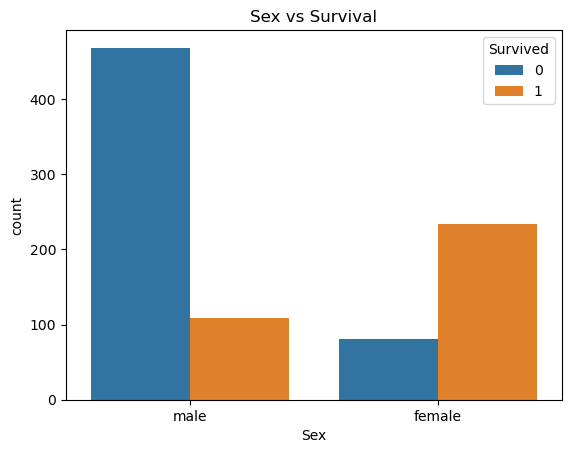
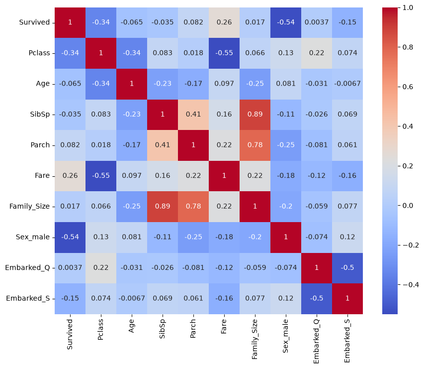

<<<<<<< HEAD
# Titanic-Survival-Analysis-and-Prediction
End-to-end Titanic survival prediction project including data cleaning, exploratory data analysis, feature engineering, model comparison, feature importance analysis, and error analysis using Logistic Regression and Random Forest.
=======
## Titanic Survival Analysis and Prediction

 # Project Overview

- This project explores the Titanic dataset to understand the factors that influenced passenger survival and builds machine learning models to predict survival outcomes

# Problem Statement

- The objective of this project is to predict passenger survival on the Titanic using machine learning techniques and understand which factors had the greatest impact on survival outcomes

# Dataset
- Dataset: Titanic Dataset
- Source: Kaggle Titanic Competition
- Records: 891 passengers
- Target Variable: Survived
 - 1 = Survived
 - 0 = Did Not Survive

### Project Workflow
1. Data Cleaning
  - Handled missing values in Age and Embarked columns
  - Removed unnecessary features
  - Checked dataset consistency
2. Feature Engineering
  - Created a new feature: Family_Size
  - Prepared categorical variables for machine learning models
3. Exploratory Data Analysis (EDA)
 - Survival Distribution
 - Survival by Gender
 - Survival by Passenger Class
 - Survival by Age
 - Survival by Fare
 - Survival by Family Size
 - Survival by Embarked Port

4. Correlation Analysis
 - Generated correlation heatmap
 - Identified relationships between features and survival

5. Model Building
 - Logistic Regression
 - Random Forest Classifier

6. Model Evaluation
 - Accuracy
 - Precision
 - Recall
 - F1 Score
 - Confusion Matrix

7. Error Analysis
 - Examined misclassified passengers
 - Identified patterns in incorrect predictions
 - Analyzed limitations of the models

# Result

 | Model               | Accuracy | Precision | Recall | F1 Score |
| ------------------- | -------- | --------- | ------ | -------- |
| Logistic Regression | 80.97%   | 79.41%    | 72.97% | 76.06%   |
| Random Forest       | 81.34%   | 85.08%    | 66.67% | 74.75%   |

- Based on recall, Logistic Regression was selected as the preferred model because identifying actual survivors was considered more important in this project

# Key Findings
- Gender was one of the strongest predictors of survival
- Passenger class significantly influenced survival chances
- Higher ticket fares were generally associated with higher survival rates 
- Logistic Regression achieved better recall
- Random Forest achieved slightly higher precision

## Visualizations

### Survival Distribution

### Survival by Gender

### Correlation Heatmap

# Conclusion

- The project demonstrated a complete machine learning workflow including data preprocessing, exploratory data analysis, feature engineering, model building, evaluation and error analysis. Logistic Regression and Random Forest produced comparable results, with Logistic Regression performing better in identifying actual survivors

# Repository Structure

- TITANIC_PRED
 -  images
    - correlation_heatmap.png
    - gender_vs_survival.png
    - survival_distribution.png

 - Titanic.ipynb
 - train.csv
 - README.md
 - .gitignore

# Technologies Used
- Python
- Pandas
- NumPy
- Matplotlib
- Seaborn
- Scikit-learn
- Jupyter Notebook

## How To Run

- git clone https://github.com/kartik2006-del/Titanic-Survival-Analysis-and-Prediction.git

- cd Titanic-Survival-Analysis-and-Prediction

- pip install pandas numpy matplotlib seaborn scikit-learn

- jupyter notebook Titanic.ipynb
>>>>>>> df19487 (Initial commit)
